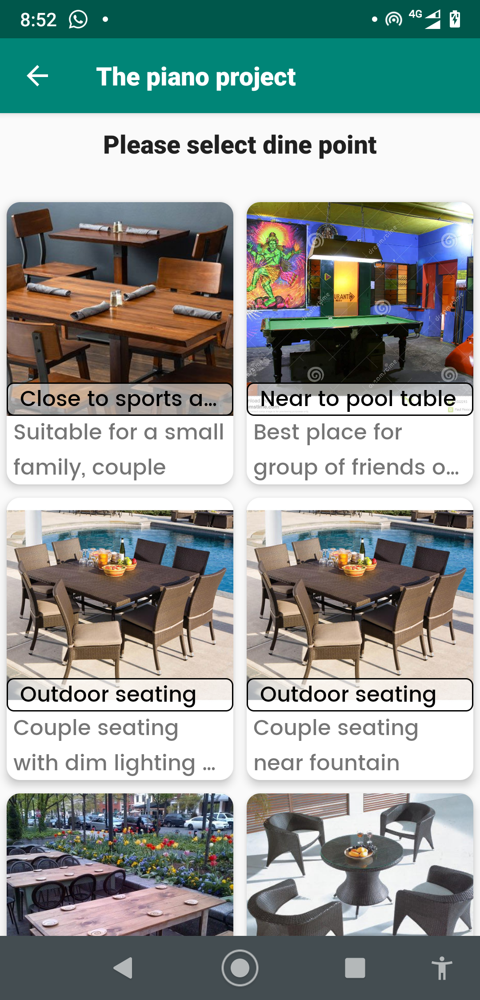
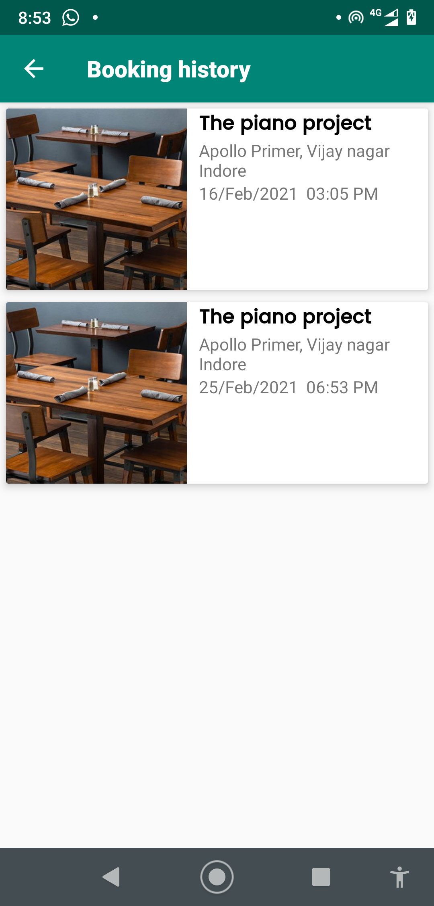

### Prerequisites
 - Android Studio 4 and above(Recommended: 4.0)
 - Gradle version: 3 and above(3.4.2 recommended)
 - Kotlin 1.3.41
 
### Programming Language
 - Kotlin

### Libraries
 - Dagger 2
 - Architecture Components(ViewModel, LiveData)
 - Glide Image Loading.
 
 ### Features and Screens
  - Restaurants list: Users would be able to see list of all restaurants available for booking dine point.
    - List item will have restaurant image, name and address
     

### Screenshot of the application

### Setup
   - Clone the Repo
   - Use Android Studio 3.4.2(If don't want to degrade the gradle and support versions), else use versions according to Android Studio version.
   - Build and Run.
   
